# Neural Machine Translation (English to Bengali)

## Introduction
Language is the heart of communication. There are $\sim7,100$ languages all over the world and hence communication between people belonging to two different cultures and having different languages has always been a challenge. Access to good quality translation as well as requirement has never been so high, which we observe currently. Large number of communications taking place online among people who speak different languages is eased by language technologies like automated machine translation, speech recognition and conversion to native languages, etc.

So, as a part of The 11th Advanced Summer School on NLP (IASNLP-2022) is scheduled to be held at IIIT Hyderabad, India, whose theme revolved around Speech to Speech Machine Translation (SSMT) in Indian Languages, I have worked in developing a Neural Machine Translation Model for English to North-Eastern Language (in my case Bengali). 
## Problem to Solve
There is a lack of literature and good models for English to North-Eastern language machine translation. Hence, it is necessary to explore the possibility of machine translation for these languages from English. Exploration of neural architechtures is what is needed and it is important to look at the performance of these base-line models in terms of machine translation so that further research and work can be put in to train better models or improve on these models.
## Data
### Train Data
The data I will be using for training is the parallel corpus provided by Samanantar dataset. It is a huge corpus of source-wise split parallel corpus of one Indian language to other or English and vice-verse. For our case we were only concerned with English to Bengali part of this dataset.

I took all the $47$ sources for English and Bengali parallel corpus and combined it into a large parallel corpus with $92,51,703$ parallel sentences. I then shuffled the sentences to obtain a homogeneous mixture of parallel sentences from all sources.
| src | tgt |
| --- | --- |
Okay, I'll be right there.| 	ওকে, এখনই আসছি
Give one's lessons.| 	পড়া দেওয়া
Much to the Witnesses' surprise, even the pros...|	সাক্ষীরা অত্যন্ত বিস্মিত হন, এমনকি সরকারি উকিল...
I am at your service.| 	আমি তোমাকে সাহায্য করার জন্যই
Via Facebook Messenger, Global Voices talked w...| 	গ্লোবাল ভয়েসস বাংলা'র পক্ষ থেকে আমরা যোগাযোগ ক...
... 	| 	...
A panel of auditors for auditing listed compan... |	নিরীক্ষা কার্যক্রমে শৃঙ্খলা আনয়নে তালিকাভুক্ত...
On this consideration, and on certain conditio...| 	সে কারণে কতিপয় শর্ত সাপেক্ষে এসব যন্ত্রাংশের ...
Under these rules, fixed price method for IPOs... |	এতে অভিহিত মূল্যে আইপিও’র জন্য ফিক্সড প্রাইস প...
Steps are being taken to introduce rural ratio... |	টিআর ও ভিজিএফ এর পরিবর্তে পল্লী রেশনিং কর্মসূচ...
I propose to rationalize rates and to introduc... |	উৎস কর: উৎস করে কয়েকটি ক্ষেত্রে করহার যৌক্তিক...

Now, due to computational resource and time constraint training on such a large dataset is impossible. Hence, I opt to use $\sim 1.7\\%$ of this massive training data.\
I also generated a bigger dataset, which is $\sim8\\%$ of the entire training data, which is used in training only a few models.

### Test Data
Now, the test data on which I evaluate the model performance is a set of $\sim250$ parallel sentences taken from Indic WAT 2021.

| src | tgt |
| --- | --- |
Through her work, she spread the message of th...| 	নিজের কর্মেরউদাহরণ স্থাপন করে তিনি মানুষকে সেব...
Interacting with beneficiaries and store owner...| 	সারা দেশের ৫ হাজারেরও বেশি স্থান থেকে দোকান মা...
These include:| 	এই প্রকল্পগুলির মধ্যে রয়েছে-
It is no surprise that today Japan is India’s ...| 	জাপান যে বর্তমানে ভারতের চতুর্থ বৃহত্তম প্রত্য...
Record growth in last two and a half years| 	গত আড়াই বছরেরেকর্ড পরিমাণ অগ্রগতি

## Data Preparation
Machine Learning Models (In our case Deep Learning Models), don't understand raw text data and hence this text data in the form of sentences need to be converted to numerical representation (vectors). So, here I will explain how I prepared the data to be fed to the Neural Network Model.
### Tokenization and Normalization
There are several types of tokenization and normalization methods based on word level, character level and subword level. Each of them has it's benefits and disadvantages ex. word level tokenization requires huge vocabualary, whereas character level requires fixed vocabulary but the input to the neural network i.e. each sentence becomes very large after tokenization and the model also finds it hard to learn relationship between characters.

Hence, I go by subword level tokenization, I use Byte-Pair Encoding to tokenize both the train and test data.\
The Byte-Pair Encoder is trained on the training data(for the bigger training data that is used to generate the byte-pair encoder) for both the source(English) and target(Bengali) languages. I used a vocabulary size of $32,000$ for both English and Bengali language.\
For normalizaion I convert the sentences of lower case and used standard unicode normalization.\
For tokenization the tokenized form of the sentence is a list of integers where the integers stand for the corresponding subword at that index in the vocabualary. I add the `bos`(beginning of sentence) token and the `eos`(end of sentence) token at the start and end of each encoded sentence in both the language. I also have the `unk`(unknown) token for the unknown subwords encountered and and `pad`(padding) token.\
For the following two examples the the BPE was trained on the smaller training data and not the bigger one.

ENGLISH SENTENCE:  Actually, it didnt.\
ENGLISH BPE SUBWORDS:  \[ "▁actually", ",", "▁it", "▁didnt", "." ]\
ENGLISH BPE ENCODED: \[ 2597, 31975, 78, 1138, 31972 ]

BENGALI SENTENCE: সত্যি, ব্যাপারটা ও ভাবে নি।\
BENGALI BPE SUBWORDS:\[ "▁সত্যি", ",", "▁ব্যাপারটা", "▁ও", "▁ভাবে", "▁নি", "।" ]\
BENGALI BPE ENCODED:\[ 1569, 31912, 3981, 56, 1225, 57, 31899 ]

### Padding
Neural Network models expect inputs of fixed length. Hence, I set some maximum length of the encoded input which I will feed our model. I take the maximum tokens allowed per sentence as 60. (`MAX_TOKENS = 60`). So, if any tokenized input is less than 60 in length then, it is padded with `pad` token. So, this makes the input data of the same shape and a 2D tensor of `BATCH_SIZE x MAX_TOKENS`. 

Batch-1:\
encoded source shape: (256, 60)\
encoded target shape: (256, 60)\
encoded source example: \[ 3, 2597, 31975, 78, 1138, 31972, 1, 0, 0, ..., 0]\
encoded target example: \[ 3, 1569, 31912, 3981, 56, 1225, 57, 31899, 1, 0, ...., 0]\
decoded source example: actually, it didnt.\
decoded target example: সত্যি, ব্যাপারটা ও ভাবে নি।

The same is done for the the test data, or a sentence, where we encode and pad it to input in the model.

### Output Sequence Selection
Neural Network is just the way to calculate the conditional probability of the next word that comes in the output sentence given the previous word generated in the output sequence till now and the input sentence in the case of Machine Translation. Now, we can opt for several ways, like Greedy Search, Beam Search, Minimizing Baye's Risk,etc. to find the output sequence with the highest joint probability. Looking for all possible combinations is computationally very expensive. Hence, we resort to heurestic and asymptotically best methods to generate the output sequence with highest probability. 
We resorted to two ways which are:
- Greedy Search: Picks the next id with the highest softmax probability. Though it works for short sentences it is not suitable for many cases.
- Minimum Baye's Risk(MBR): Generates multiple candidate translations. Compare each one of them with all other using a similarity score(in our case ROUGE). Then, choosing the one with the highest similarity score, gives us the candidate translation that is in consensus with all the generated samples.

ROUGE metric | 
--|
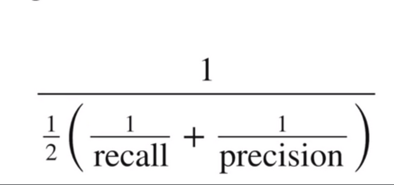|
MBR Selection Criterion|
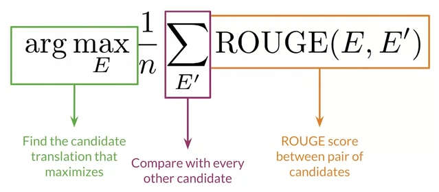

## Models
I focussed only on Transformer based architechtures. I changed the Hyperparameters of the Transformer and trained several of these models to compare their performance.

### 1 Layer Transformer Architechture
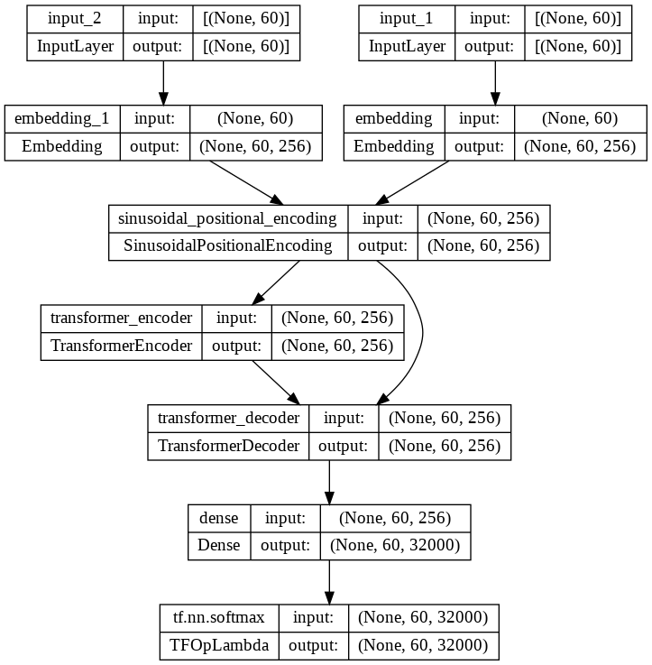

8 Heads | 8 Heads Big
--|--
`Number of Layers = 1`|`Number of Layers = 1`
`Number of Heads = 8`|`Number of Heads = 8`
`Embedding Dimension = 256`|`Embedding Dimension = 256`
`Key Dimension = 32`|`Key Dimension = 32`|
`Value Dimension = 32`| `Value Dimension = 32`
`154836 Parallel Sents`|`728047 Parallel Sents`
`Epochs = 10` | `Epochs = 10`|
`Batch Size = 256` | `Batch Size = 256`
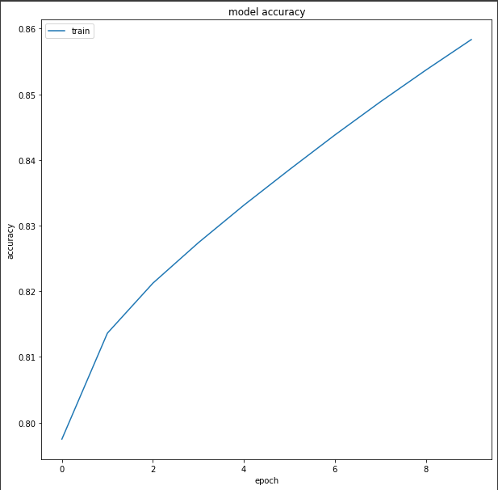|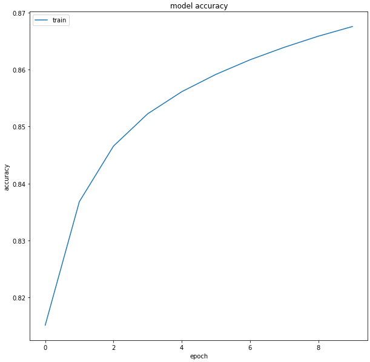
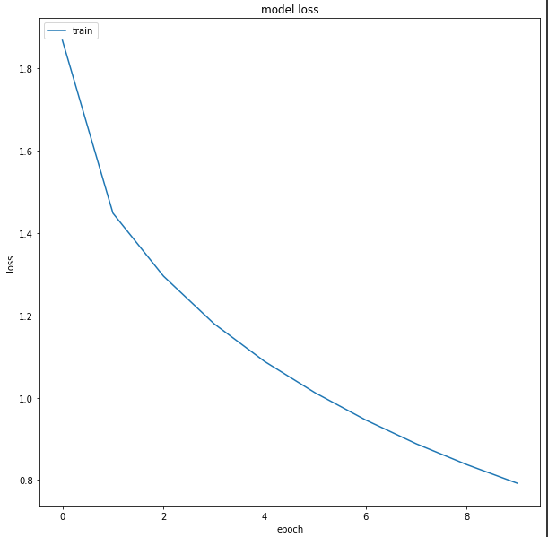|
BLEU = 1.51|BLEU = 3.03
chrF2 = 25.52|chrF2 = 29.33
TER = 100.29|TER = 96.24

Sample Translation:

Heads|English|Bengali Translation: MBR Score(10 samples)| Reference Translation
---|-----|----|--
8 |I love you.|তোমায় ভালোবাসি।?: 0.83, আমি তোমায় ভালবাসি।: 0.83|আমি তোমাকে ভালোবাসি।
8 |How are you.|তুমি কেমন আছ।: 0.93, তুমি কেমন আছ?: 0.89| তুমি কেমন আছো।
8 |I am hungry.|আমি ক্ষুধার্ত মানুষ।: 0.80, আমি ক্ষুধার্ত।: 0.74| আমি ক্ষুধার্ত।
8 |I am a boy.|আমি ছেলে।: 0.98, আমি তো ছেলে।: 0.85| আমি ছেলে।
8 Big | I love you.|ভালোবাসি।: 0.36, আমার সঙ্গে ভালবাসার সম্পর্ক।: 0.36| আমি তোমাকে ভালোবাসি।
8 Big | How are you.|কেমন আছো তুমি।: 0.99, তুমি কেমন আছো।: 0.99| তুমি কেমন আছো।
8 Big | Hyderabad is a beautiful city.|হায়দরাবাদের সুন্দর শহর।: 0.8576, হায়দ্রাবাদের একটি শহর।: 0.8573| হায়দ্রাবাদ একটি সুন্দর শহর।
8 Big | My name Rishi.|আমার নাম ঋষি।: 0.87, আমার নাম।: 0.83|আমার নাম ঋষি।

Manual Evaluation of 8 Heads Model on the Test Data and Train Developement Data:
English|Bengali Translation|Adequacy|Fluency
--|--|--|--
Are we leaving for good?|আমরা ভাল যাব?|0|0
Investigation was taken away.|তদন্ত করে খুঁজতে তদন্ত করা হয়েছে।0|0
The palace is an extended part of a huge complex.|প্রাসাদটি একটি জটিল জটিল একটি জটিল স্তর ধারণ করে।|0|0
Then he abruptly disappeared.|তারপর হঠাৎ হারিয়ে গেলো সে।|4|4
He had a rope tied around his waist.|তার কোমর ঘিরে ফেলে তিনি।|1|4
There have been numerous ideas and attempts to reduce the amount of carbon emissions.|অনেকগুলি অণুযায়ী অনেক কিছু সফ্টভ্যতার জন্য প্রয়োজনীয় উপাদান সরবরাহ করা হয়েছে।|0|0
In India, faith and Nature have had a deep link since ancient times.|ভারতে, বিশ্বাস এবং প্রকৃতি এবং প্রকৃতি যে প্রাচীন কালে ছিল ভারত।|2|1
What kind?|কোন ধরনের?|4|4
India has emerged as a bright spot in the global economy which is driving global growth as well.|ভারতে বিশ্ব অর্থনীতি সারা বিশ্বে একটি উজ্জ্বল শিল্প সঞ্চার করে এবং বিশ্বের অর্থনীতি বিশ্বব্যাপী বিনিয়োগ করছে।|2|2
Do you think it is possible for mere humans to come to know our almighty Creator, as stated here in the Bible?|আপনার কি মনে হয়, তুমি কি জানো আর আমাদের সৃষ্টিকর্তা সম্বন্ধে জানতে পারবে না?|3|2

*Due to same failure in saving weights after model training and before manual evaluation of the model generated output for the 8 Heads Big was not done.*

### 2 Layer Transformer Architechture
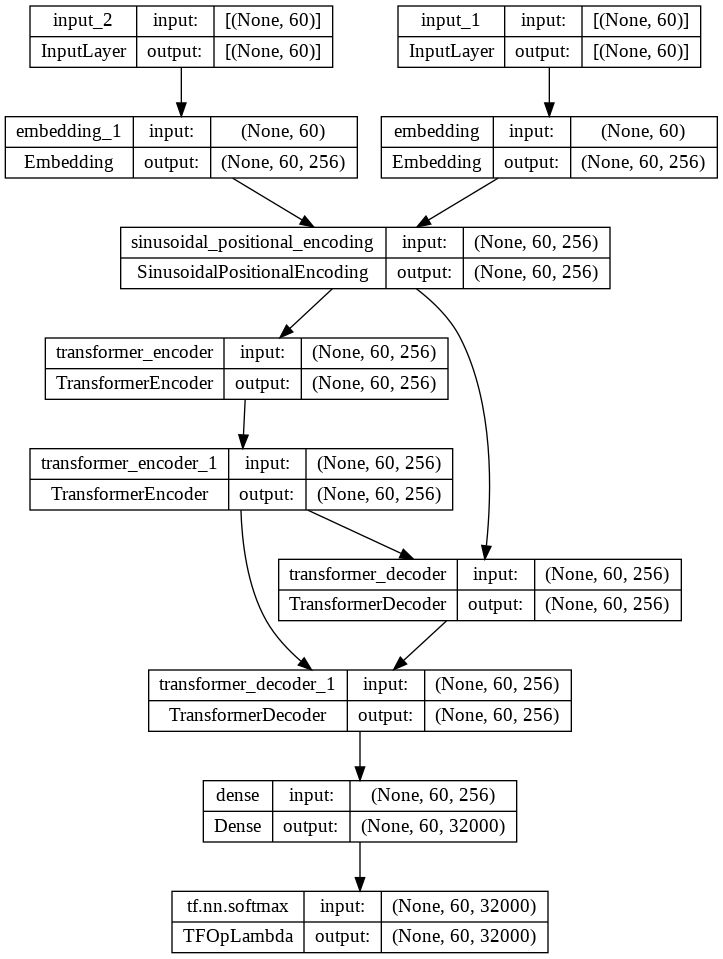

4 Heads | 8 Heads| 8 Heads Big | 8 Heads Dim Mod
--|--|--|--
`Number of Layers = 2`|`Number of Layers = 2`|`Number of Layers = 2`|`Number of Layers = 2`|
`Number of Heads = 4`|`Number of Heads = 8`|`Number of Heads = 4`|`Number of Heads = 8`|
`Embedding Dimension = 256`|`Embedding Dimension = 256`|`Embedding Dimension = 256`|`Embedding Dimension = 512`|
`Key Dimension = 32`|`Key Dimension = 32`|`Key Dimension = 32`|`Key Dimension = 64`|
`Value Dimension = 32`| `Value Dimension = 32`|`Value Dimension = 32`| `Value Dimension = 64`|
`154836 Parallel Sents`|`154836 Parallel Sents`|`728047 Parallel Sents`|`154836 Parallel Sents`
`Epochs = 10` | `Epochs = 20`|`Epochs = pre-trained weights from 8 Heads + 10`|`Epochs = 10`
`Batch Size = 256` | `Batch Size = 256`| `Batch Size = 256`| `Batch Size = 256`|
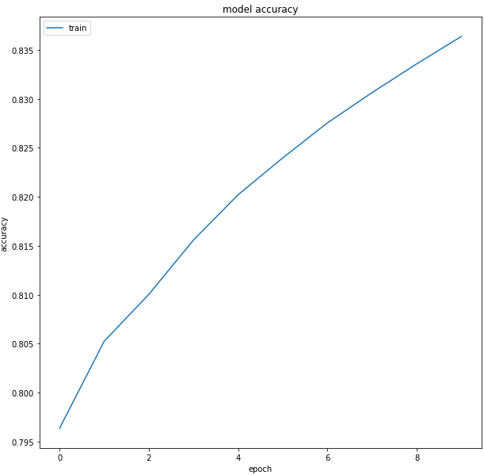|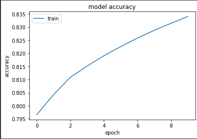|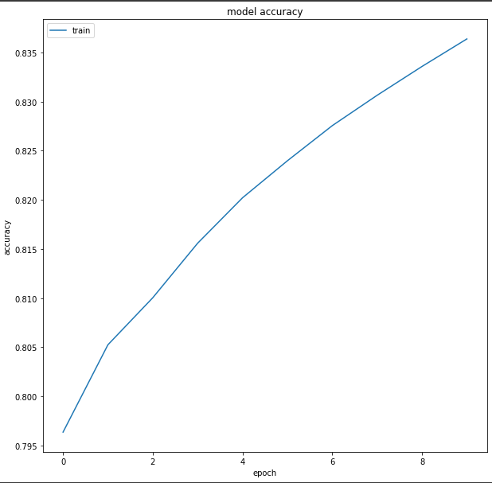|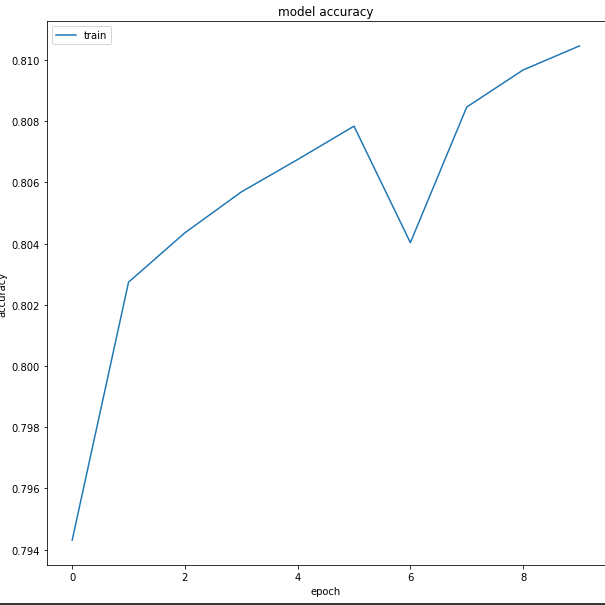
||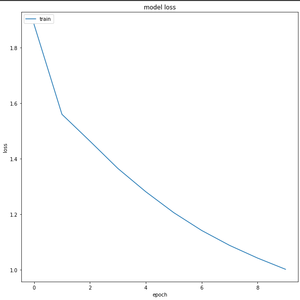|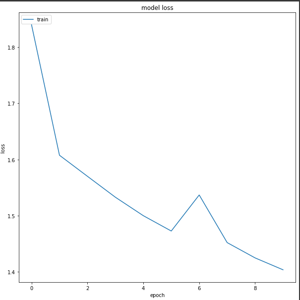
BLEU = 0.80|BLEU = 1.07|BLEU = 2.82|BLEU = 0.06
chrF2 = 20.25|chrF2 = 20.48|chrF2 = 29.59|chrF2 = 5.04
TER = 107.92|TER = 98.69|TER = 93.91|TER = 99.45

Sample Translations:
Heads|English|Bengali Translation: MBR Score(10 samples)| Reference Translation
---|-----|----|--
4 |I love you.| আমি তোমাকে ভালোবাসি।: 0.98, আমি তোমাকে ভালবাসি।: 0.97|আমি তোমাকে ভালোবাসি।
4 |Thank You!|ধন্যবাদ!: 0.99, ধন্যবাদ তোমার!: 0.72|ধন্যবাদ!
4 | Modiji is India's Prime Minister. | কিন্তু নরেন্দ্র মোদী সরকার।: 0.81,নরেন্দ্র মোদী সরকারের ভারত।: 0.77 | মোদিজি ভারতের প্রধানমন্ত্রী
8 | I am tired. |আমি ক্লান্ত হয়ে গেছি।: 0.93, ক্লান্ত হয়ে গেছি।: 0.86| আমি ক্লান্ত
8 | How are you? |তুমি কেমন আছো?: 0.80, তুমি কেমন আছ?: 0.70| তুমি কেমন আছো?
8 | Hello! | হ্যালো! | হ্যালো!
8 | Let's start!| আসুন শুরু যাক!| চল শুরু করি!
8 Big|Let's Start!|চলো, শুরু করি!: 0.72, চলো শুরু করছি!: 0.72|চল শুরু করি!
8 Big|I like Durga Puja very much.|আমি দুর্গা পূজা করতে খুব পছন্দ করি।: 0.76, আমার কাছে দুর্গা পূজা খুব ভাল লাগে।: 0.76, আমি দুর্গা পূজা খুব ভালোবাসি।: 0.75|আমি দুর্গা পূজা করতে খুব পছন্দ করি।
8 Big| I am hungry|আমি ক্ষুধার্ত।: 0.95, আমার ক্ষুধার্ত।: 0.87|আমি ক্ষুধার্ত।
8 Dim|I love you.|কিন্তু অপরিবর্তিত থাকতে পেরেছিলেন ঠিক।: 0.52, ১৩ ঈশ্বরের বাক্য বাইবেল জোর নেই।: 0.52| আমি তোমাকে ভালোবাসি।
8 Dim|I am hungry.|তার সঙ্গে, আমরা কী বলি?: 0.50, আমাদের দিন থেমে যায়।: 0.48| আমি ক্ষুধার্ত।

Manual Evaluation of 8 Heads Big Model on the Test Data and Train Developement Data:
English|Bengali Translation|Adequacy|Fluency
--|--|--|--
His demise is anguishing.|তাঁর মৃত্যু মহাসমাঢ়।|4|3
This is the ninth interaction in the series by the Prime Minister through video conference with the beneficiaries of various Government schemes.|প্রধানমন্ত্রীর বিভিন্ন প্রকল্পের মাধ্যমে এই আলোচনা সভা ছাড়াও প্রধানমন্ত্রী বিভিন্ন ধরনের সচিবদের সঙ্গে আলাপ-আলোচনা করবেন।|0|1
He said that the Union Government is working with an approach of “isolation to integration” to develop all the hitherto under-developed parts of the country.|প্রধানমন্ত্রী বলেছেন, দেশের সার্বিক উন্নয়নের লক্ষ্যে কেন্দ্রীয় সরকার একযোগে কাজ করছে।|1|4
Imran khan taking oath.|শপথ নিলেন ইমরান খান।|4|4
Samsung has been heavily rumoured to launch two new mid-end smartphones the Galaxy J7 (2017) and Galaxy J5 (2017).|স্যামসাং গ্যালাক্সি এম ০১ (২০১৭) এবং স্যামসাং (২০১৭-১৮৯), স্যামসাং এর দুটি নতুন স্মার্টফোন বাজারে এসেছে।|1|3
Hence, the people in the area are in panic.|ফলে আতঙ্কে রয়েছে এলাকাবাসী।|4|4
The issue has not come to my notice.|বিষয়টি আমার নজরে আসেনি।|4|4
But there is no use.|কিন্তু তাতে কোনও লাভ হয়নি।|2|4
I just hate feeling helpless.|আমি শুধু অসহায় বোধ করি।|1|4
I congratulate the Finance Minister Arun Jaitley Jee for presenting an excellent Budget.|এ নিয়ে বাজেট বক্তৃতায় প্রধানমন্ত্রী নরেন্দ্র মোদীর সঙ্গে বিভিন্ন বাজেটের জন্য শুভেচ্ছা জানাই।|0|0

### 3 Layer Transformer Architechture
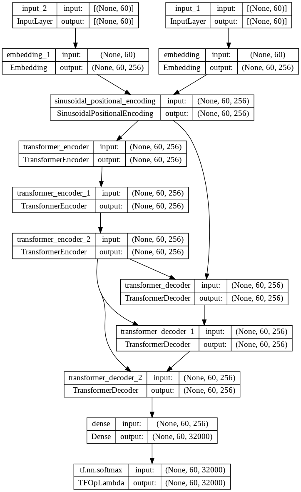

Hyperparameters: `Number of Layers = 3`,`Number of Heads = 4`, `Embedding Dimension = 256`, `Key Dimension = 32`, `Value Dimension = 32`, `154836 Parallel Sents`, `Epochs = 10` ,`Batch Size = 256`

Accuracy|Loss
--|--
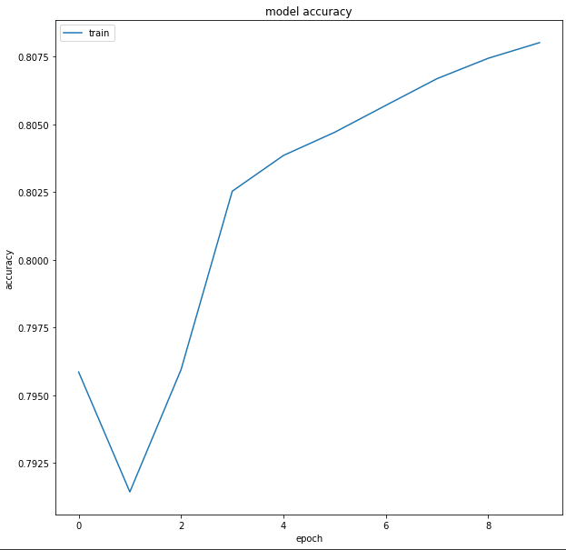|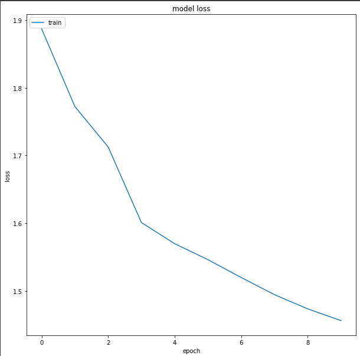|

BLEU|chFR2|TER
--|--|--
0.01|2.85|211.89|

Sample Translation:
Heads|English|Bengali Translation: MBR Score(10 samples)| Reference Translation
---|-----|----|--
4 |I love you.|কলকাতা, নোয়াখালী মতো-এর নিচে পূর্ণ করে তাদের কম কাছে খুশি করা এবং অন্যটি যা বিভিন্ন পরিশ্রম হয়।: 0.37, তারা গোকীতে আমি এই ভূমিকা।: 0.37|আমি তোমাকে ভালোবাসি।

Manual Evaluation of any test data sample gives 0 Adequacy and 0 Fluency

### 4 Layer Transformer Architechture

4 Heads | 4 Heads Big
--|--
`Number of Layers = 4`|`Number of Layers = 4`
`Number of Heads = 4`|`Number of Heads = 4`
`Embedding Dimension = 256`|`Embedding Dimension = 256`
`Key Dimension = 32`|`Key Dimension = 32`|
`Value Dimension = 32`| `Value Dimension = 32`
`154836 Parallel Sents`|`728047 Parallel Sents`
`Epochs = 10` | `Epochs = 10`|
`Batch Size = 256` | `Batch Size = 256`
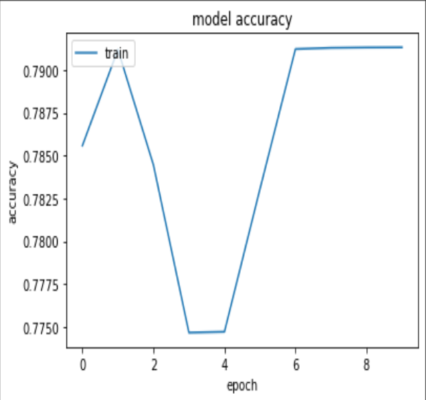|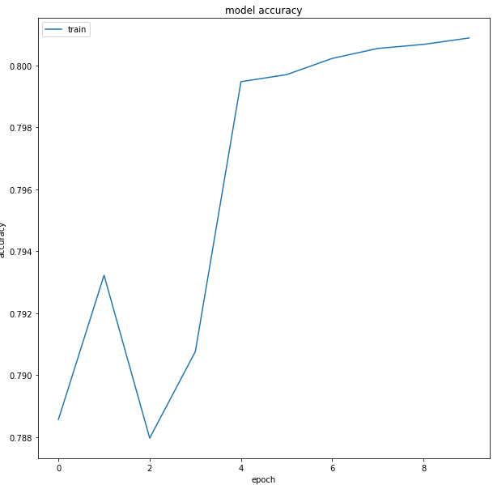
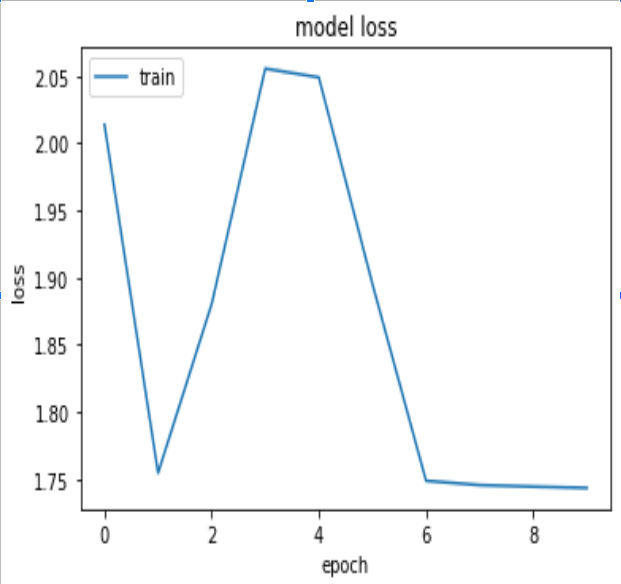|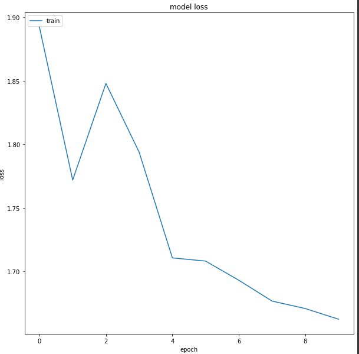
BLEU = 0.00|BLEU = 0.00
chrF2 = 3.29|chrF2 = 2.18
TER = 429.87|TER = 100.00

Sample Translation:
Heads|English|Bengali Translation: MBR Score(10 samples)| Reference Translation
---|-----|----|--
4 |I love you.| কিন্তু কিন্তু কিন্তু কিন্তু কিন্তু কিন্তু কিন্তু কিন্তু কিন্তু কিন্তু কিন্তু কিন্তু কিন্তু কিন্তু কিন্তু কিন্তু কিন্তু কিন্তু কিন্তু কিন্তু কিন্তু কিন্তু কিন্তু কিন্তু কিন্তু কিন্তু কিন্তু কিন্তু কিন্তু কিন্তু কিন্তু কিন্তু কিন্তু কিন্তু কিন্তু কিন্তু কিন্তু কিন্তু কিন্তু কিন্তু কিন্তু কিন্তু কিন্তু কিন্তু কিন্তু কিন্তু কিন্তু কিন্তু কিন্তু কিন্তু কিন্তু কিন্তু কিন্তু কিন্তু কিন্তু কিন্তু কিন্তু কিন্তু কিন্তু|আমি তোমাকে ভালোবাসি।
4 Big|I love you.|দেশের ছোট সরকারি ওঁকে সামনে।: 0.43, রাস্তায় কোন তেমনটা কোন পেয়েছে পারে কারো এখানে এ গ্রেপ্তারবেন হয় করে সঙ্গে।: 0.43| আমি তোমাকে ভালোবাসি।

Manual Evaluation of any test data sample gives 0 Adequacy and 0 Fluency

## Model Comparison on Adequacy and Fluency Scores
- Average adequacy score on test data using model with 1 Layer 8 heads and 2 Layers 8 heads big are 1. 6 and 2.1 respectively. Hence, the information of the english sentence is better preserved in the later model.
- Average fluency score on test data using model with 1 Layer 8 heads and 2 Layers 8 heads big are 1. 7 and 3.1 respectively. Hence, the quality of translated sentences are better in later model.
- Larger models are having Zero (0) adequacy and fluency score for many translations. 
- General observation 
    - Even though the models are able to generate proper bengali sentences, they are lacking the content (adequacy) present in the english counterparts.
    - The translated sentences are shorter than reference sentences, 
    - Since it is low resource setting, the model with lower complexity performs better.
    - Model performs poorly on longer sentences.

## Conclusion
In this Neural Machine Translation from English to Bengali. I have gone through various aspects and whatever little literature was available. I have explored several Transformer Based architechtures, which were not that much used in the literature. 
- Model faces issues in fitting when it grows in complexity but has less data avaialbe to train all the parameters.
- Out of all the models trained starkingly the one with the least complexity seems to perform the best that is the transformer with 1 Layer and 8 Heads. The reason might be due to not that big training data. 
- The model exposed to larger data performs better than the one exposed to less data.
- Model trained on larger data is able to translate named entity better, even if it hasn't seen it before in the data.(Like my Name Rishi, Places name like Hyderabad)
- The Model learns associations between words quite well e.g. Modiji is converted to Narendra Modi in translations due to its appearance multiple times in dataset.
- Larger Models tend to robust to punctuation marks.
- Model faces issue in discriminating between spellings like ভাল and ভালো.

Hence, we conclude larger models are only helpful, if there is large amount of data available. Exploration of modern State of the Art Transformer Models with larger corpus and availability of proper computatioal resources can highly boost the performance of these Neural Machine Translation Models. Our exploration is highly constrained by time and availabiliy of compuational resources.

## Notebooks Details:
- `Data-Preparation.ipynb`: Deals with pre-processing and creating the data that was used to train and test the models.
- `Neural_Machine_Translation_tf_<i>L_<j>H.ipynb`: Deals with the model training and evaluation for i layers, j heads transformer on the smaller dataset.
- `Neural_Machine_Translation_tf_<i>L_<j>H_BigData.ipynb`: Deals with the model training and evaluation for i layers, j heads transformer on the bigger dataset.
